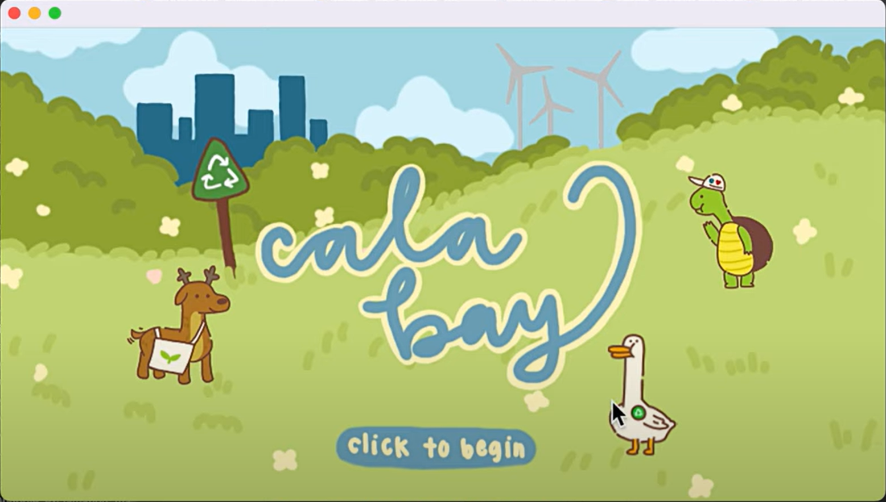
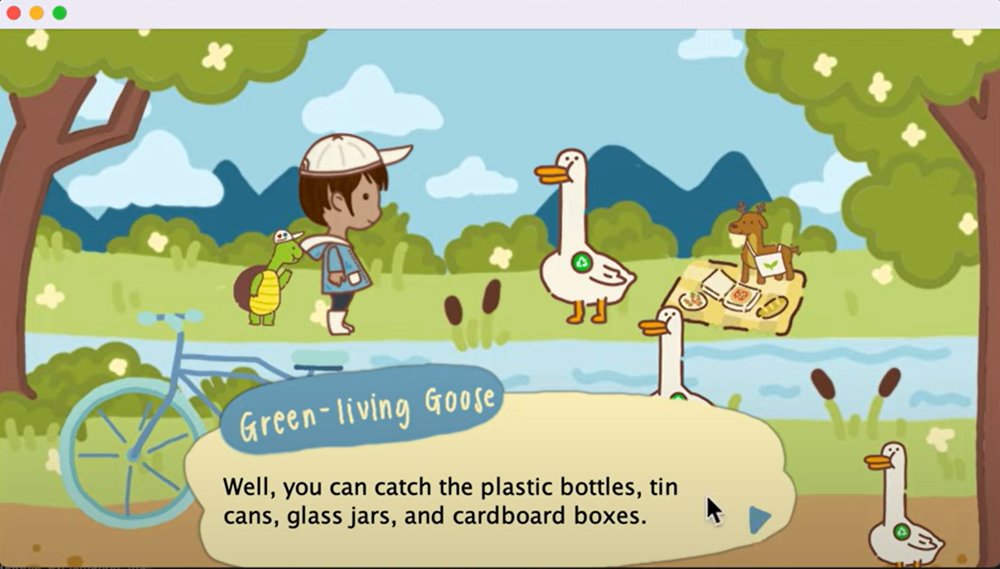
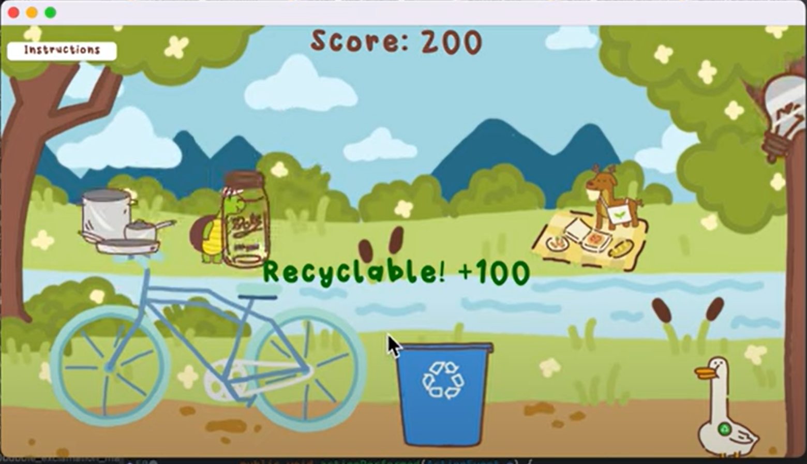

## CalHacks April 2023 Hack Month Submission

  
  
  

A game, built in Java, that promotes environmental sustainability. _Created by Colin Rondon, Andrei Duque, Lauren Vo, and Angela Huynh._

This game consists of _3 different levels_:\
1.) a trivia level to teach the user environmentally-friendly habits like carpooling or biking instead of driving a car solo\
2.) a game where the users learn recyclable vs. non-recyclable objects, by catching recyclable objects and avoid non-recyclables, both falling from the top of the screen\
3.) a level with smaller mini-games that teach the user to turn off unused electrical appliances.

Some notable programming features in this program are: first, I used timer listeners/objects to make the recyclable and non-recyclable objects appear randomly plus move on their own at different speeds. I also used timer listeners to animate avatars and playable characters. For example, when the user moves the avatar using the arrow keys, I use a timer listener to make the avatar go through the different walking sprites/frames smoothly and make the background move if the player goes to the edge of the screen and there is still space to move around. Second, I used collision mechanics that involves keeping track of the coordinates of all the falling objects at scattered spots and comparing them to the coordinates of the trash can, which is controlled by the user’s mouse.

[Here is a video synopsis explaining each of the 3 levels.](https://youtu.be/Uyp3ljLLolY?si=nNR7iJKyN-PVRsRu)

Our 1st place finish in this Hack Month hack earned us a guaranteed spot at Cal Hacks 10.0.
